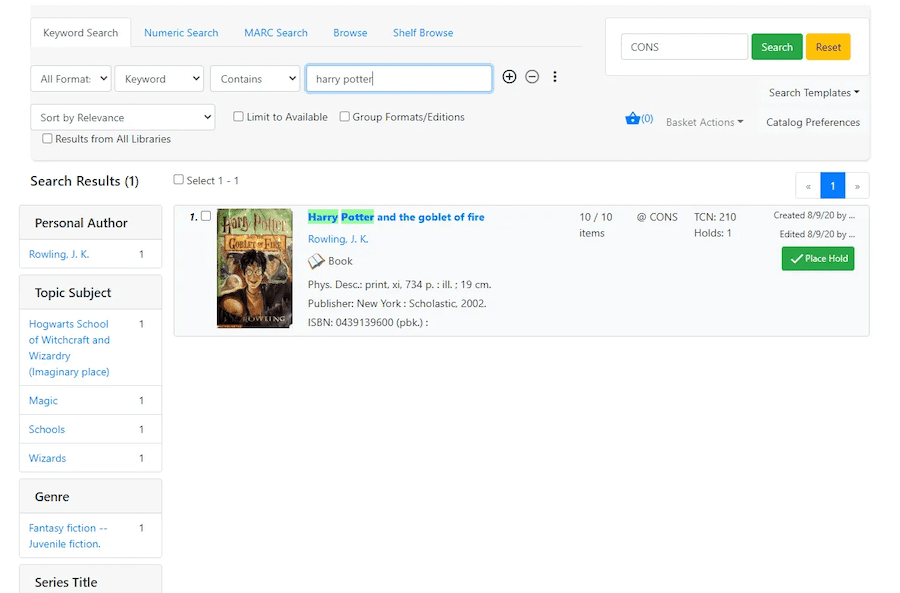

# Evergreen

|                   |                                          |
|:------------------|:-----------------------------------------|
| model             | Collaborative, Independent Development
| service type      | Public Services
| country           | United States
| states            | many
| government type   | state
| license           | open
| website           | [https://evergreen-ils.org/](https://evergreen-ils.org/)
| repository        | [https://git.evergreen-ils.org/](https://git.evergreen-ils.org/)
| governance docs   | [https://evergreen-ils.org/governance/](https://evergreen-ils.org/governance/)

## Description

Evergreen is an open source integrated library system (ILS) created by the Georgia Public Library Service in 2005 to support their 275 libraries. Building it was necessary when the state moved to a statewide library card system, and they weren’t satisfied with the proposals they got from ILS vendors. Funding support was provided by a grant from the [Institute of Museum and Library Services](https://www.imls.gov/). After several years of development, and after launching their own [Georgia PINES](https://gapines.org/) based on Evergreen, the state released the software under an open source license, so that it could be used elsewhere. It proved popular with libraries that didn’t want to use a commercial ILS, but that were too big for [Koha](https://koha.org/) to work for them. Evergreen is now deployed worldwide in over 2,000 libraries, including a number of U.S. state-level catalogs.

Today, the software is maintained by [a purpose-created non-profit organization](https://evergreen-ils.org/governance/), the Evergreen Project, which pools member contributions to support development. Georgia remains an important contributor to the project, but Evergreen is now a true community-supported effort that isn’t dependent on its initial creators. The nine-member board holds annual elections for three of its members, based on votes cast by contributors to the code, documentation, or committees, and by employees of organizations using Evergreen. The Evergreen Project’s funding comes from conference sponsorships and from support from Evergreen-development vendors, and about 70% of the budget goes to software development.

Institutions using Evergreen contribute to improving the software as they are able, with work done by employees of those libraries or by vendors who they pay to perform the work.

The Evergreen Project has recently created the Evergreen Community Development Initiative, as a sort of consortium of consortiums — 14 different co-ops are pooling their funding via contributions to the Evergreen Project, to support their collective software development. A committee selects the projects that work will fund, and the Evergreen Community Development Initiative Evergreen awards a contract to a developer that works on Evergreen.

Evergreen runs on a Linux web server and is interacted with both via a web browser and installed desktop clients. The server is written in Perl and uses Apache and PostgreSQL, while the desktop client is written in AngularJS.

The existence of Evergreen has spawned the creation of many other cooperatives based on it, such as [Missouri Evergreen](http://moevergreenlibraries.org/), [NC Cardinal](https://statelibrary.ncdcr.gov/ld/nc-cardinal), [Evergreen Indiana](https://www.in.gov/library/evergreen.htm), [Pennsylvania Integrated Library System](https://sparkpa.org/) and quite a few others. They provide libraries with catalogs via a statewide Software as a Service (SaaS) model, allowing libraries to have full-featured catalogs without the technical requirements of hosting and maintaining the underlying software. These cooperatives are funded by state budgets, IMLS funding, and/or Library Services and Technology Act funding. Collectively, approximately 1 in 10 U.S. libraries are using Evergreen, and that’s likely to increase as commercial vendors’ long-term contracts start to expire, freeing library systems to transition to Evergreen.
