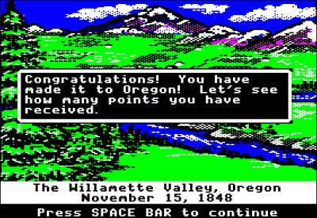

# Minnesota Educational Computing Consortium (MECC)

- model: Collaborative Organizational Licensing
- service type: Education
- country: United States
- states: Minnesota
- government type: local
- license: unknown
- URL: [https://en.m.wikipedia.org/wiki/MECC](https://en.m.wikipedia.org/wiki/MECC)

## Description
MECC was established by the Minnesota legislature in 1973, and remained a going interest until 1999. They grew out of a mainframe time-sharing collaborative comprised of 20 school districts, which started in 1968. They coordinated and wrote software for schools throughout Minnesota, producing such educational games as Oregon Trail, Number Munchers, ad Word Munchers.

MECC started selling the software to schools outside of Minnesota, and MECC's software became popular throughout the world during the 1980s. In 1983 MECC became a for-profit, state-owned business, and it was later spun off as a publicly traded business.
